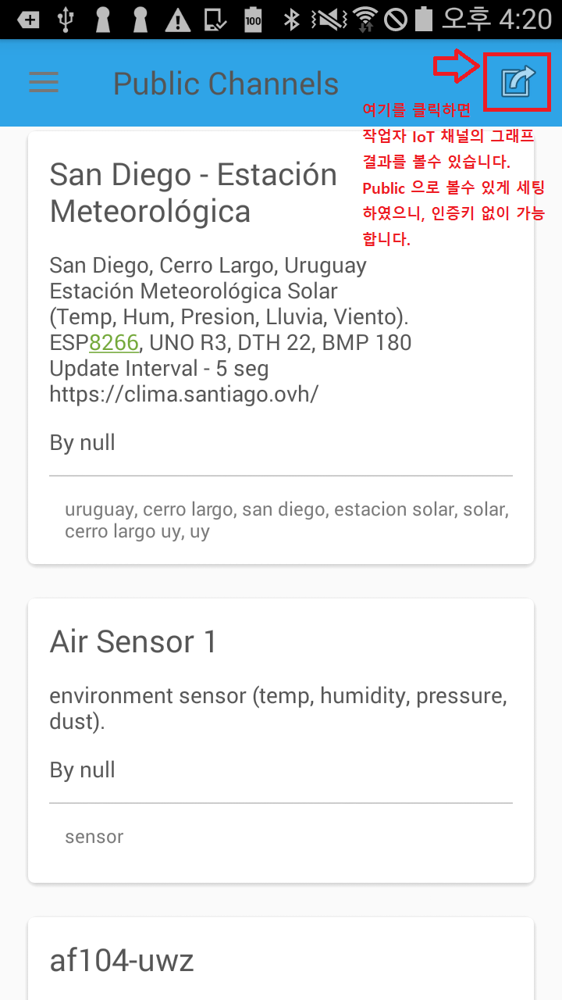
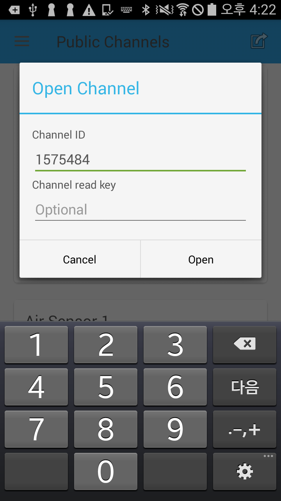
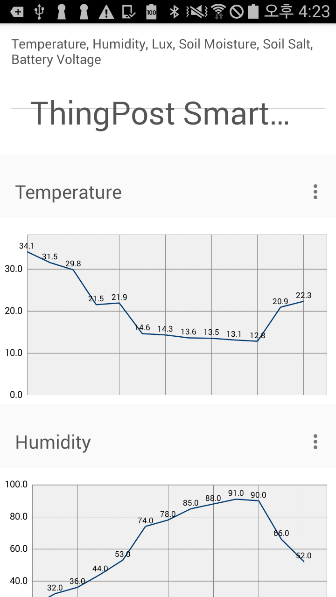

### ThingSpeak 클라우드 자료를 출력하는 클라이언트 안드로이드 앱 마이그레이션
- 7년전에 만들어진 소스(오픈소스) https://github.com/vetoketju/ThingSpeak-client-android
- 현재 프로젝트는 버전이 너무 오래 되어서, androidx 에서 빌드가 가능하게 변경 처리
- 기술참조: https://themach.tistory.com/76

#### 작업 결과 히스토리(아래)
- 다음 시간에는 머신러닝(지도학습) 으로 의미있는 추측(추론) 을 할 수 있도록 하겠습니다.
- 오렌지 3 라는 AI 분석 툴을 사용할 예정 입니다.
- IoT 정보를 머신러닝으로 데이터 분석_안드로이드앱제작: https://blog.daum.net/web_design/776
- IoT 정보를 머신러닝으로 데이터 분석_클라우드와연동: https://blog.daum.net/web_design/775
- IoT 정보를 머신러닝으로 데이터 분석_IoT프로그램밍: https://blog.daum.net/web_design/774
- IoT 정보를 머신러닝으로 데이터 분석_IoT보드사용이해: https://blog.daum.net/web_design/773
- IoT 정보를 머신러닝으로 데이터 분석_사전지식확인:  https://blog.daum.net/web_design/772

#### 결과 미리보기
- 초기화면은 누군가 ThingSpeak 에서 public 으로 등록한 채널이 보입니다.(아래)

- 제가 생성한 클라우드 채널에 접속하는 화면 입니다.(아래_인증키는 필요 없음)

- 현재 까지의 데이터 수집 결과를 스마트폰에서 확인 할 수 있습니다.(아래)

